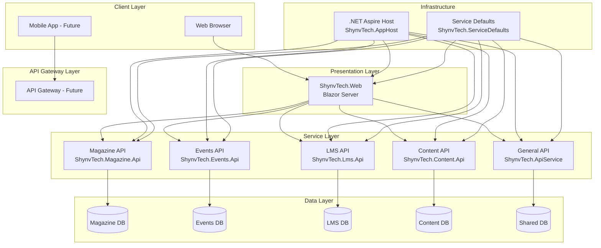

# ShynvTech Architecture Documentation

This document describes the architecture of the ShynvTech platform, a distributed application built with .NET Aspire 9 that serves as a **tech innovation collective** for software professionals, community builders, and continuous learners.

## Architecture Overview

The ShynvTech platform follows a **microservices architecture** pattern, designed to support professional showcase, community building, and knowledge sharing. Each service responsible for a specific domain area, orchestrated using **.NET Aspire 9** with Azure Cloud-native capabilities.

### Core Platform Principles

- **Community-First Design**: Supporting mentorship, events, and professional networking
- **AI-Enhanced Experience**: Leveraging Azure OpenAI and LangChain integration
- **Professional Excellence**: Showcasing technical expertise and leadership impact
- **Scalable Architecture**: Built for growth from local communities to global reach



## Service Architecture

### 1. ShynvTech.AppHost (Orchestration)

**Purpose**: Centralized orchestration and service discovery

**Technologies**:

- .NET Aspire 9
- Service Discovery
- Configuration Management
- Health Checks

**Responsibilities**:

- Service registration and discovery
- Configuration distribution
- Health monitoring
- Development dashboard

### 2. ShynvTech.Web (Frontend)

**Purpose**: User-facing web application

**Technologies**:

- Blazor Server (.NET 9)
- Tailwind CSS
- Google Fonts
- Font Awesome
- SignalR (built-in)

**Features**:

- Responsive landing page
- Server-side rendering
- Real-time updates
- SEO-friendly

### 3. ShynvTech.Magazine.Api (Magazine Service)

**Purpose**: Manage monthly magazines for college students

**Domain Responsibilities**:

- Magazine CRUD operations
- Issue management
- Subscription handling
- Content publishing

**Endpoints** (Planned):

```http
GET    /api/magazines
POST   /api/magazines
GET    /api/magazines/{id}
PUT    /api/magazines/{id}
DELETE /api/magazines/{id}
GET    /api/magazines/{id}/issues
POST   /api/magazines/{id}/issues
```

### 4. ShynvTech.Events.Api (Events Service)

**Purpose**: Event planning and management

**Domain Responsibilities**:

- Event creation and management
- Registration handling
- Calendar integration
- Notification system

**Endpoints** (Planned):

```http
GET    /api/events
POST   /api/events
GET    /api/events/{id}
PUT    /api/events/{id}
DELETE /api/events/{id}
POST   /api/events/{id}/register
GET    /api/events/calendar
```

### 5. ShynvTech.Lms.Api (Learning Management System)

**Purpose**: Educational content and course management

**Domain Responsibilities**:

- Course management
- Student progress tracking
- Assessment handling
- Resource management

**Endpoints** (Planned):

```http
GET    /api/courses
POST   /api/courses
GET    /api/courses/{id}
GET    /api/courses/{id}/modules
POST   /api/courses/{id}/enroll
GET    /api/students/{id}/progress
```

### 6. ShynvTech.Content.Api (Content Service)

**Purpose**: Manage static content (About Us, Contact Us, etc.)

**Domain Responsibilities**:

- Static page content
- Contact form handling
- FAQ management
- General information

**Endpoints** (Planned):

```http
GET    /api/content/about
GET    /api/content/contact
POST   /api/content/contact
GET    /api/content/faq
PUT    /api/content/{page}
```

### 7. ShynvTech.ApiService (General Service)

**Purpose**: Shared functionality and cross-cutting concerns

**Responsibilities**:

- Authentication/Authorization
- File upload/download
- Notifications
- Reporting
- Audit logging

### 8. ShynvTech.ServiceDefaults (Shared Library)

**Purpose**: Common configurations and utilities

**Includes**:

- OpenTelemetry configuration
- Health check setups
- Common middleware
- Service discovery configuration
- Resilience patterns

## Design Patterns

### 1. Microservices Pattern

**Benefits**:

- Independent deployment
- Technology diversity
- Fault isolation
- Scalability

**Challenges**:

- Distributed complexity
- Data consistency
- Network latency
- Testing complexity

### 2. Service Discovery

**Implementation**: .NET Aspire built-in service discovery

**Benefits**:

- Dynamic service location
- Load balancing
- Health checking
- Configuration management

### 3. Shared Kernel

**Implementation**: ShynvTech.ServiceDefaults

**Purpose**:

- Common configurations
- Shared utilities
- Cross-cutting concerns
- Consistency across services

## Data Architecture

### Database Strategy

**Current**: In-memory/file-based (development)
**Planned**: Database per service pattern

**Future Database Layout**:

```
ShynvTech_Magazine_DB
├── Magazines
├── Issues
├── Subscriptions
└── MagazineContent

ShynvTech_Events_DB
├── Events
├── Registrations
├── Venues
└── Categories

ShynvTech_LMS_DB
├── Courses
├── Modules
├── Students
├── Progress
└── Assessments

ShynvTech_Content_DB
├── Pages
├── FAQs
└── ContactSubmissions

ShynvTech_Shared_DB
├── Users
├── Audit
└── Configuration
```

## Security Architecture

### Authentication & Authorization

**Planned Implementation**:

- **Identity Provider**: Azure AD B2C or Auth0
- **Token Type**: JWT Bearer tokens
- **Authorization**: Role-based access control (RBAC)

### Security Layers

1. **Transport Security**: HTTPS everywhere
2. **API Security**: JWT token validation
3. **Data Security**: Encryption at rest and in transit
4. **Input Validation**: Model validation and sanitization

## Observability

### Monitoring Stack

**Built-in with .NET Aspire**:

- **Metrics**: OpenTelemetry metrics
- **Logging**: Structured logging with Serilog
- **Tracing**: Distributed tracing
- **Health Checks**: Service health monitoring

### Dashboard Features

- Service health status
- Performance metrics
- Log aggregation
- Distributed traces
- Configuration viewer

## Deployment Architecture

### Development

```
Local Machine
├── .NET Aspire Dashboard
├── All services running locally
└── In-memory data storage
```

### Production (Planned)

```
Azure Container Apps
├── ShynvTech.Web (Frontend)
├── ShynvTech.Magazine.Api
├── ShynvTech.Events.Api
├── ShynvTech.Lms.Api
├── ShynvTech.Content.Api
├── ShynvTech.ApiService
└── Azure SQL Database (per service)
```

## Scalability Considerations

### Horizontal Scaling

- **Stateless Services**: All APIs are stateless
- **Load Balancing**: Built into Azure Container Apps
- **Auto-scaling**: Based on CPU/memory/request metrics

### Performance Optimization

- **Caching**: Redis for distributed caching
- **CDN**: Azure CDN for static assets
- **Database**: Read replicas for read-heavy operations

## Future Enhancements

### Phase 2 Features

1. **API Gateway**: Centralized routing and security
2. **Event Sourcing**: For audit and replay capabilities
3. **CQRS**: Separate read/write models for complex scenarios
4. **Message Queue**: Async communication between services

### Phase 3 Features

1. **Mobile Apps**: React Native or .NET MAUI
2. **Real-time Features**: SignalR hubs for live updates
3. **Analytics**: Application Insights and custom dashboards
4. **Multi-tenancy**: Support for multiple organizations

## Technology Decisions

### Why .NET Aspire?

- **Unified Development**: Single development experience
- **Built-in Observability**: Comprehensive monitoring
- **Service Discovery**: Simplified inter-service communication
- **Cloud-Ready**: Optimized for cloud deployment

### Why Microservices?

- **Domain Separation**: Clear boundaries between business areas
- **Team Autonomy**: Different teams can work independently
- **Technology Choice**: Freedom to choose best tools per service
- **Scalability**: Scale services independently based on demand
